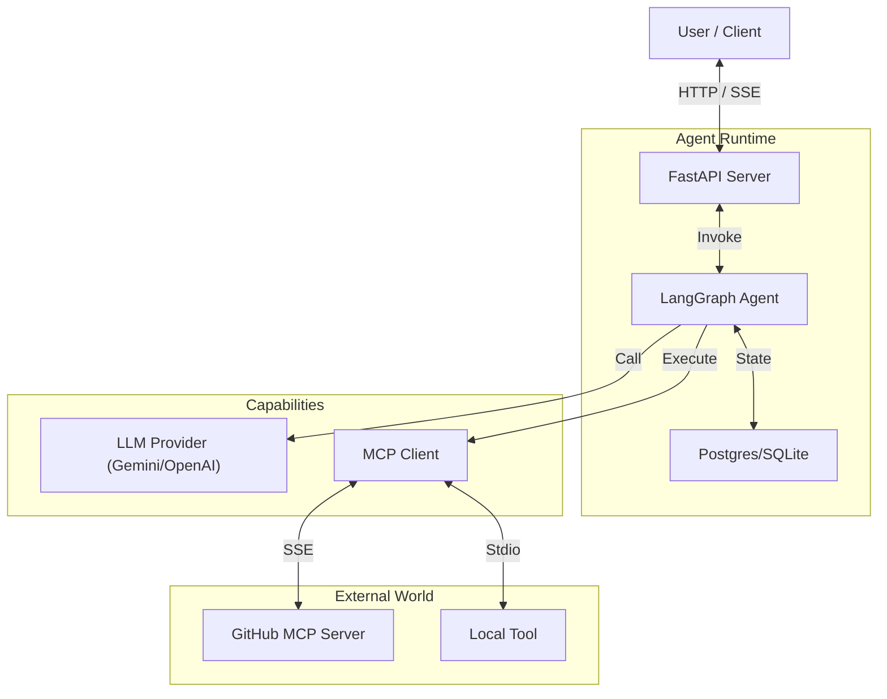

# System Architecture

The **Agent Bridge** is designed as a modular, event-driven system that orchestrates interactions between Users, AI Models, and External Tools.

## High-Level Overview

## Core Components

### 1. The Client (Frontend)
*   **Framework**: Vue 3 + Vite.
*   **State Management**: Pinia for managing auth, current conversation, and settings.
*   **Real-time Updates**: Uses Server-Sent Events (SSE) to display agent thoughts and partial token streaming in real-time.

### 2. The Server (Backend)
*   **Framework**: FastAPI.
*   **Database**: SQLAlchemy with Async support. Defaults to SQLite for dev, compatible with PostgreSQL.
*   **Task Queue**: (Roadmap) Celery/Redis for long-running background jobs.

### 3. The Agent Engine
We use **LangGraph** to define the agent's behavior as a directed graph.
*   **Nodes**: Represent steps like "Reason", "RetreiveContext", "ExecuteTool".
*   **Edges**: Define the logic for control flow (e.g., "If tool required -> Go to ExecuteTool, else -> End").
*   **Memory**: Persists the graph state (checkpointing), allowing human-in-the-loop features like pausing and resuming.

### 4. Model Context Protocol (MCP)
This is the core connectivity layer.
*   **MCP Client**: The server acts as an MCP Client.
*   **Transports**: 
    *   **SSE**: Connects to remote servers (e.g., a GitHub agent running on another machine).
    *   **Stdio**: Connects to local subprocesses (e.g., a local file system agent).
