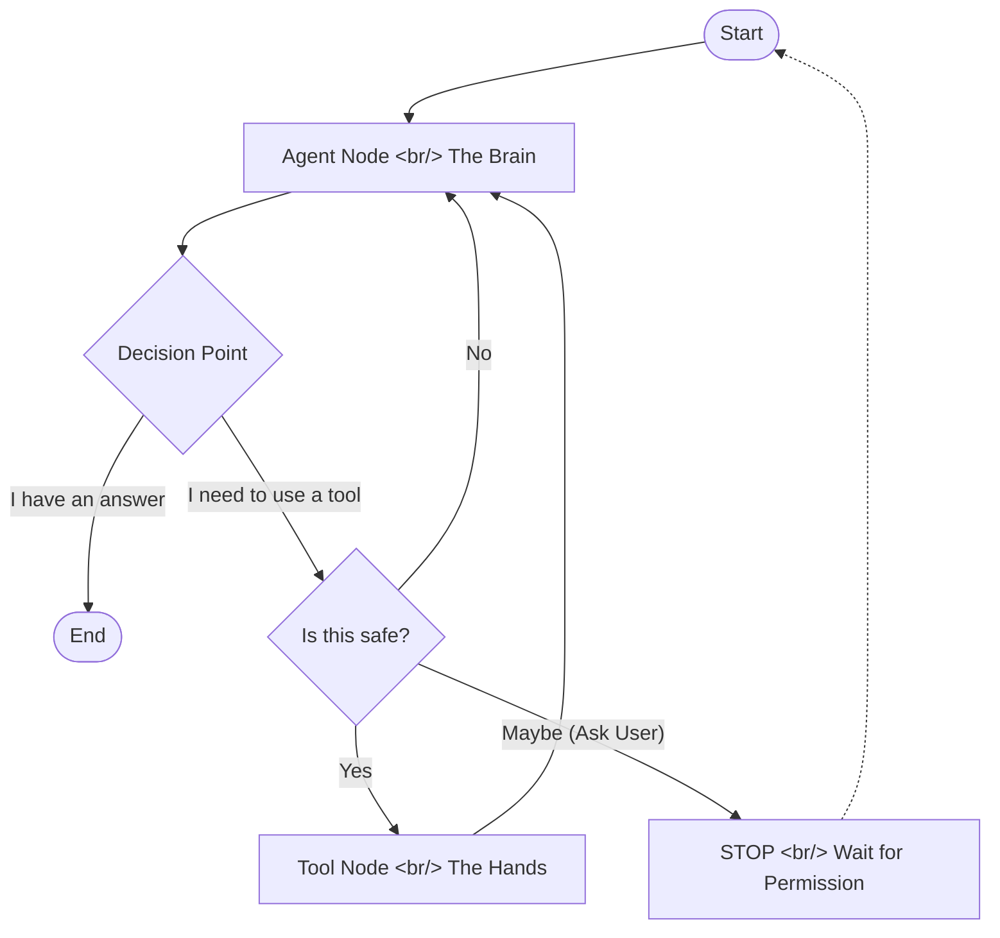

# Module 2: The Nervous System (Orchestrator)

## 1. Introduction: Thinking in Loops

If you have ever written a basic Python script, you are used to **linear thinking**. You write line A, then line B, then line C. The computer follows your instructions one by one.

But an Agent doesn't work like that. An Agent needs to behave more like a human.
When you try to solve a problem—say, "Fix the bug in `login.py`"—you don't just execute a single pre-planned list of steps. You **loop**.

1.  **Think**: "I should read `login.py`."
2.  **Act**: You open the file.
3.  **Observe**: You see the code.
4.  **Think**: "Ah, I see a typo. I should fix it."
5.  **Act**: You type the fix.
6.  **Observe**: Use unit tests to verify.
7.  **Think**: "Tests passed. I'm done."

This is a **Cycle**. You might cycle through this loop 5 times or 50 times. You don't know when you start.

In our codebase, the file `backend/app/services/agent/agent_orchestrator.py` is the engine that drives this cycle. We call it **The Orchestrator**.

## 2. The Engine: LangGraph

To represent this cycle in code, we use a library called **LangGraph**.
LangGraph allows us to define our agent not as a straight line, but as a **State Machine**.

Imagine a board game.
*   **The Tokens**: This is the `AgentState`. It's just a list of all the messages spoken so far.
*   **The Spaces**: These are the **Nodes** (Python functions).
*   **The Rules**: These are the **Edges** (Logic that says "Go to X next").

### The Board Layout




## 3. The Components (The Anatomy)

Let's look at the actual Python functions that make up these board spaces.

### Node 1: The Brain (`sub_agent_node`)
This is where the intelligence lives. We take the entire conversation history (the `AgentState`) and send it to the LLM (like Gemini or Claude).

The LLM does one of two things:
1.  **Talks**: It returns a text response. ("Hello! How can I help?")
2.  **Calls**: It returns a structured command to use a tool. (`tool_calls=[{"name": "github_create_issue"}]`)

Crucially, this is where we "attach" the tools. We use `llm.bind_tools(tools)` to tell the LLM: "Here are the tools you are allowed to use right now."

### The Router (`route_tools`)
Once the Brain has spoken, this function looks at the output.
*   **Did the Brain produce text?** -> Great, the turn is over. Send it to the user.
*   **Did the Brain ask for a tool?** -> Okay, we need to go to the Tool Node. But first... is it safe?

### Node 2: The Hands (`tools`)
If the Router says "Go ahead," the workflow lands here.
This node is very simple. It takes the tool name (e.g., `github_create_issue`) and the arguments the LLM generated, finds the corresponding Python function, runs it, and captures the result.

The result (e.g., "Issue #123 created successfully") is added to the conversation history as a `ToolMessage`.

**And then... The Loop.**
Notice in the diagram that the arrow points from "The Hands" back to "The Brain".
This is critical. The Agent needs to *know* that the issue was created. It receives the `ToolMessage`, reads it, and then thinks again: "Okay, the issue is created. Now I should tell the user."

## 4. The State (`AgentState`)

You might be wondering, "How does the Agent remember what happened 5 steps ago?"

It's all in the `AgentState`. In our code, this is simply a list of messages.
Here is what the memory looks like after a few turns:

```python
[
    HumanMessage(content="Please create a bug report."),
    AIMessage(content="", tool_calls=[{"name": "create_issue"}]),  # The Agent decided to act
    ToolMessage(content="Issue #42 created."),                    # The Tool executed
    AIMessage(content="I have created the issue for you.")        # The Agent confirmed
]
```

Every node receives this list, adds to it, and passes it to the next node.

## 5. Summary

The **Orchestrator** is the nervous system that keeps the agent moving.
*   It is not a straight line; it is a **loop**.
*   It uses **LangGraph** to manage the flow between Thinking (Brain) and Acting (Hands).
*   It maintains a continuous **State** (Memory) so it never loses track of the conversation.

Now that we understand *how* the agent thinks, we need to understand *how* it gets its tools in the first place. For that, we turn to the next module.
